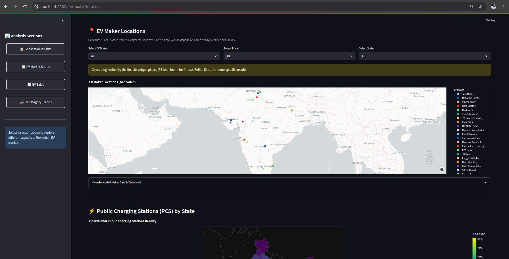

#  India EV Insights (2001 to 2024)


**A Streamlit-based interactive dashboard for analyzing Electric Vehicle (EV) sales, infrastructure, and trends across India.**

This project was developed for a hackathon to provide actionable insights into the Indian EV market, leveraging data visualization and geospatial analysis. The **India EV Insights Dashboard** empowers users to explore EV sales by manufacturers and categories, visualize EV maker locations, analyze public charging station distribution, and track registration trends over time. Built with Python, Streamlit, and Plotly, this dashboard is intuitive, data-driven, and visually engaging.

Dataset - [Kaggle](https://www.kaggle.com/datasets/srinrealyf/india-ev-market-data/data)

Webiste - [Url]()

---

##  Project Overview

The Indian EV market is rapidly growing, driven by government policies, consumer demand, and infrastructure development. This dashboard provides a comprehensive view of the EV ecosystem in India by analyzing:

- **EV Sales Trends**: Sales performance by year, manufacturer, and vehicle category, including market share and growth insights.
- **Geospatial Insights**: Locations of EV manufacturers and the distribution of public charging stations across Indian states.
- **Vehicle Registrations**: Distribution of EV registrations by vehicle class and daily registration trends by category.
- **Key Performance Indicators (KPIs)**: Total EV registrations, sales in the latest year, and operational charging stations.

The dashboard is designed for policymakers, industry stakeholders, and enthusiasts to make data-driven decisions and understand market dynamics.

---

##  Features

The dashboard is organized into four interactive sections, accessible via a sidebar navigation:

### 1. Geospatial Insights:
   - **EV Maker Locations**: Interactive map showing geocoded locations of EV manufacturers, filtered by maker, place, or state.
   - **Charging Stations Map**: Choropleth map visualizing the density of public charging stations by state, highlighting infrastructure distribution.

### 2. EV Market Status:
   - Bar and pie charts displaying EV registrations by vehicle class.
   - Line chart showing aggregated EV sales trends over time across all manufacturers and categories.

### 3. EV Sales:
   - Detailed sales analysis with filters for year and manufacturer.
   - Visualizations include:
     - Pie chart for market share of top manufacturers.
     - Bar chart for top 10 manufacturers by sales volume.
     - Bar chart for sales by vehicle category.
     - Growth analysis showing percentage sales growth for manufacturers between the earliest and latest years.

### 4. EV Category Trends:
   - Heatmap of daily EV registrations by category over a selected date range.
   - Line chart for registration trends of a specific EV category, with customizable date filters.

### Additional Features:
- **Interactive KPIs**: Displays total EV registrations, latest-year sales, and operational charging stations on every page.
- **Data Downloads**: Users can download filtered datasets as CSV files for further analysis.
- **Responsive Design**: Clean, professional UI with custom CSS styling for readability and aesthetics.
- **Geocoding**: Dynamic geocoding of EV maker locations using the Nominatim API, cached for performance.

---

##  Data Sources

The dashboard leverages datasets from various sources, primarily sourced from Kaggle and processed for analysis:

1. **Vehicle Class - All.csv**: Total EV registrations by vehicle class.
2. **ev_sales_by_makers_and_cat_15-24.csv**: Yearly EV sales by manufacturer and category (2015–2024).
3. **EV Maker by Place.csv**: EV manufacturer names and their associated places/states for geocoding.
4. **OperationalPC.csv**: Number of operational public charging stations by state.
5. **ev_cat_01-24.csv**: Daily EV registration data by category (Jan 2024 onwards).
6. **india_with_disputed_boundaries.geojson**: GeoJSON file for rendering state-level choropleth maps.

**Note**: All datasets are cleaned and normalized (e.g., state names standardized) to ensure consistency with GeoJSON mappings and accurate visualizations.

---

## 🛠 Technical Stack

- **Programming Language**: Python 3.8+
- **Web Framework**: Streamlit for building the interactive dashboard.
- **Data Processing**: Pandas for data manipulation, GeoPandas for geospatial data handling.
- **Visualization**: Plotly Express for interactive charts (bar, pie, line, heatmap, scatter, choropleth).
- **Geocoding**: Geopy with Nominatim API for converting place names to latitude/longitude coordinates.
- **Geospatial Mapping**: Mapbox integration via Plotly for scatter and choropleth maps.
- **Caching**: Streamlit's `@st.cache_data` for optimizing data loading and geocoding performance.
- **Styling**: Custom CSS for a polished, user-friendly interface.
- **Dependencies**: Listed in `requirements.txt` (e.g., `streamlit`, `pandas`, `plotly`, `geopy`, `geopandas`).

---

##  Project Structure

```
project/
│
├── app.py                         # Main Streamlit application script
├── data/                          # Directory for datasets and GeoJSON
│   ├── Vehicle Class - All.csv
│   ├── ev_sales_by_makers_and_cat_15-24.csv
│   ├── EV Maker by Place.csv
│   ├── OperationalPC.csv
│   ├── ev_cat_01-24.csv
│   ├── india_with_disputed_boundaries.geojson
├── images/                        # Directory for header images
│   ├── bg_home.png
│   ├── bg_glance.png
│   ├── bg_sales.png
│   ├── bg_category.png
├── notebooks/                     # Directory for exploratory data analysis
│   ├── eda.ipynb
├── requirements.txt               # Python dependencies
├── README.md                      # Project documentation
```

---

##  Example Visualizations

Here are some sample outputs from the dashboard:

1. **Home Page Dashboard**:
   

2. **EV Maker Locations Map**:
   

3. **Charging Stations Choropleth**:
   

4. **Sales Market Share**:
   

5. **Category Registration Heatmap**:
   

---

##  Why This Project Stands Out

- **Comprehensive Analysis**: Covers sales, infrastructure, and registration trends, providing a 360-degree view of the Indian EV market.
- **Interactive and User-Friendly**: Streamlit’s intuitive interface, combined with Plotly’s interactive charts, makes data exploration seamless.
- **Geospatial Innovation**: Dynamic geocoding and choropleth mapping add a spatial dimension to EV market insights.
- **Scalable Design**: Modular code structure and caching make it easy to extend with new datasets or features.
- **Hackathon-Ready**: Polished visualizations, clear documentation, and a focus on actionable insights make this project impactful for judges.


---

## 👤 Author

**Vignesh S**  
🔗 [LinkedIn](https://www.linkedin.com/in/vignesh-s-9b86a7243)  
📧 Email: vigneshvaran0101@gmail.com   

This project was built with passion for data science and sustainable mobility. Feedback and contributions are welcome!

---

## 📜 License

This project is licensed under the MIT License. See the [LICENSE](LICENSE) file for details.

---

*Happy Hacking! 🚗⚡*
